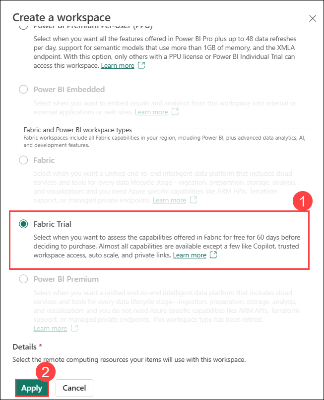

# Exercise 01: Creating a Fabric Workspace and Eventhouse for Real-Time Intelligence

### Estimated duration: 30 Minutes

## Overview

In this exercise, you will explore **Real-Time Intelligence** to gain insights from streaming data, and create a **Fabric Workspace** to organize and collaborate on your projects. You will set up an **Eventhouse** to efficiently store and analyze event-driven data, enable **OneLake Availability** for seamless data integration.

## Objectives:

In this exercise, you will be able to complete the following tasks:

- Task 1: Experience Real-Time Intelligence.  
- Task 2: Create a Fabric Workspace.
- Task 3: Create an Eventhouse.
- Task 4: Enable OneLake Availability.

## Task 1: Experience Real-Time Intelligence

In this task, you will explore Real-Time Intelligence and its categories, gaining an understanding of its various components and functionalities.

1. Select **Workloads** icon on the left of your screen. A dialog with the list of Fabric experiences will open. The list of experiences includes Power BI, Data Factory, Industry Solutions, Real-Time Intelligence, Data Engineering, Data Science and Data Warehouse. Let’s explore.

    

    >**Note:** If you do not see Workloads icon, click on the three horizontal dots at the bottom of the left navigation pane to expand and find Workloads.

1. Scroll down to the bottom and select **Real-Time Intelligence** under Workloads.

    

1. You will be navigated to **Real-Time Intelligence Home page**. You will see **Item types** under **About**, and **Get started** categories. With the **Item type** category notice the items:

    a. **Eventhouse:** Used to create a workspace of one or multiple KQL database(s), which can be shared across projects.
    
    b. **KQL** **Queryset:** Used to run queries on the data to produce shareable tables and visuals.
    
    c. **Real-Time Dashboard**: A collection of tiles, optionally organized in pages, where each tile has an underlying query and a visual representation.
    
    d. **Eventstream:** Used to capture, transform, and route real-time event stream.
    
    e. **Activator:** For automatically taking actions when patterns or conditions are detected in changing data.

    f. **Event Schema Set (preview):** The Event Schema Set (preview) in Microsoft Fabric’s Real-Time Intelligence is designed to help you manage and standardize the structure of streaming data.
       
    g. **Operations agent**: Operations agents in Fabric Real-Time Intelligence automate the observe → analyze → decide → act cycle, helping organizations turn real-time data into immediate, actionable decisions. Instead of relying on manual monitoring and intervention, these agents continuously track key metrics, surface insights, and recommend targeted actions. They enable teams to respond quickly and optimize operations at scale. Each operations agent is a dedicated Fabric item, designed for a specific business process.

    h. **Map (preview)**: Map (preview) is a powerful geospatial visualization platform that transforms spatial data, whether static or real-time, into actionable intelligence. By uncovering patterns, relationships, and trends across space and time, Map reveals insights often missed in traditional charts and tables, helping you make informed decisions with greater clarity.

    i. **Digital Twin Builder (preview):** Digital Twin Builder lets you create digital replicas of physical environments, assets, and processes. These replicas-called digital twins-are built using an ontology, which is a structured model of entities and their relationships.

    j. **Anomaly detection(Preview)**: It provides below recommended models and allows you to set up continuous monitoring with automated actions.
     * Model recommendations: Suggests the best algorithms and parameters for your data.
     * Interactive anomaly exploration: Visualize detected anomalies and adjust model sensitivity.
     * Continuous monitoring: Set up real-time anomaly detection with automated notifications.
     * Reanalysis with new data: Update your models as new data arrives to improve accuracy.
       
   
    

## Task 2: Create a Fabric Workspace

In this task, you will create a workspace to begin working with Real-Time Intelligence.

1. Now let’s create a workspace with Fabric license. Select **Workspaces (1)** from the navigation bar on the left.

1. Select  **+ New workspace (2)**.

    

1. The **Create a workspace** dialog opens on the right side of the browser.

1. In the **Name** field enter **RTI_<inject key="DeploymentID" enableCopy="false"></inject>** **(1)**. 

   >**Note**: The user ID will be unique for each user, and the workspace name must also be unique. Ensure that a green check mark with **"This name is available"** appears below the Name field.

1. If you would like, you can enter a **Description** for the workspace. This is an optional field.

1. Click on **Advanced (2)** to expand the section.

    

1. Under **License mode**, select **Fabric Trial (1)**, then click **Apply (2)** to create a new workspace.

    

    >**Note:** If the **Introducing task flows** dialog opens, click on **Got it**.

> **Congratulations** on completing the task! Now, it's time to validate it. Here are the steps:
> - Hit the Validate button for the corresponding task. If you receive a success message, you can proceed to the next task. 
> - If not, carefully read the error message and retry the step, following the instructions in the lab guide.
> - If you need any assistance, please contact us at cloudlabs-support@spektrasystems.com. We are available 24/7 to help you out.

<validation step="0cf9b162-7a65-422c-b1f0-86178c692f30" />

## Task 3: Create an Eventhouse
In this task, you will create an Eventhouse, which is used for storing, processing, and analyzing real-time streaming data efficiently within Microsoft Fabric.

1. Click the **+ New item** box to open a new pane that has all the items you can create in this Fabric workspace.

    

1. Search for **Eventhouse (1)** and Select the **Eventhouse (2)** option from Store data . As we have talked about this can be viewed  similarly to a Lakehouse in that we can store data but this Eventhouse is focused around real time data.

    

1. In the window that appears, give your Eventhouse the name, **WebEvents_EH (1)** and click on **Create (2)**.

    

    >**Note:** if Welcome to Eventhouse! pop-up appears. Click on **Get started**.

1. The Eventhouse efficiently handles real-time data streams, enabling organizations to ingest, process, and analyze data in near real-time. It is optimized for time-based, streaming events, automatically indexing and partitioning data based on ingestion time.

> **Congratulations** on completing the task! Now, it's time to validate it. Here are the steps:
> - Hit the Validate button for the corresponding task. If you receive a success message, you can proceed to the next task. 
> - If not, carefully read the error message and retry the step, following the instructions in the lab guide.
> - If you need any assistance, please contact us at cloudlabs-support@spektrasystems.com. We are available 24/7 to help you out.

<validation step="e0e12ffc-7d34-4768-aaef-c3d89d6e615f" />

## Task 4: Enable OneLake Availability
In this task, you’ll enable OneLake Availability to automatically copy KQL Database data to OneLake in Delta format, allowing seamless querying through Lakehouse and other tools. It’s best enabled before loading large datasets and can be set per table.

1. When an Eventhouse is created, a KQL Database with the same name is created as well. To open the KQL Database click on the Database **WebEvents_EH** in the section **KQL Databases**.

    

2. After selecting the KQL Database. Click on the switch **Availability** (Change the setting from Disable to Enable) under **Database details** to **enable** the OneLake availibility as shown in the screenshot.

    

    >**Note:** Newly created tables will automatically inherit the "OneLake availability" setting from the Database level

3. Now the dialog **Enable OneLake Availability** is shown. Ensure that Apply to existing tables is checked and click on the button **Enable**.

    

## Summary

In this exercise, you have explored the Real-Time Intelligence experience in Microsoft Fabric, created a Fabric Workspace, set up an Eventhouse for real-time data storage and analysis, and enabled OneLake Availability for seamless data integration. These foundational steps will allow you to effectively manage and analyze streaming data within Microsoft Fabric.

### You have successfully completed the exercise. Now, click on **Next >>** from the lower right corner to proceed on to the next exercise.

