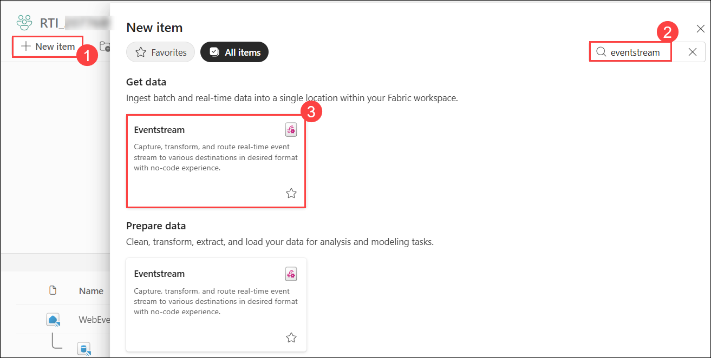
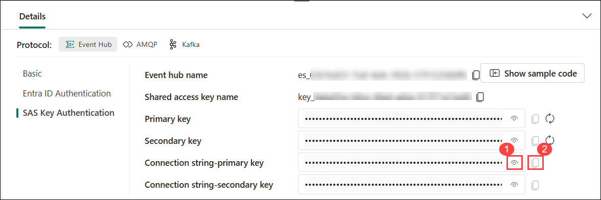
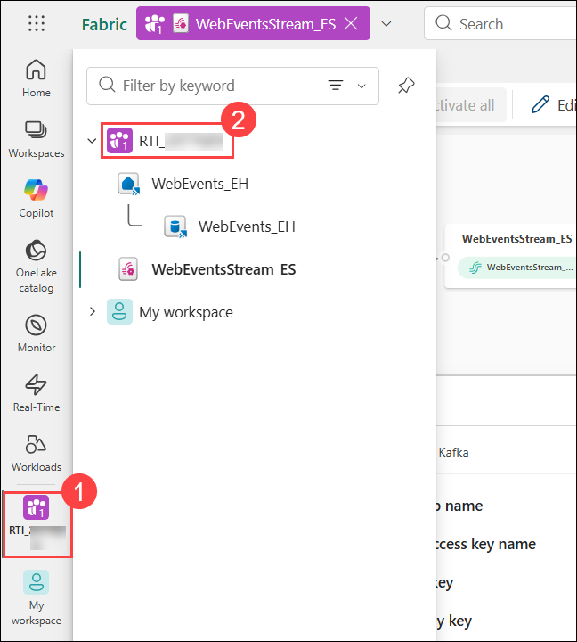
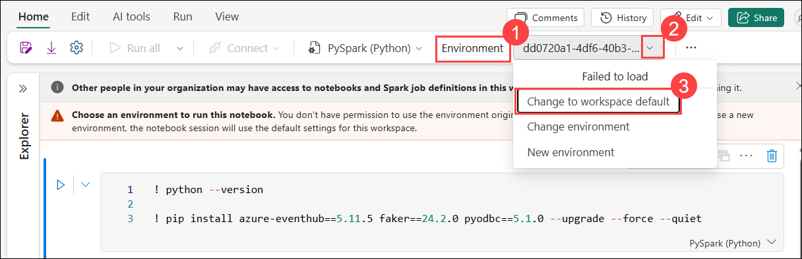
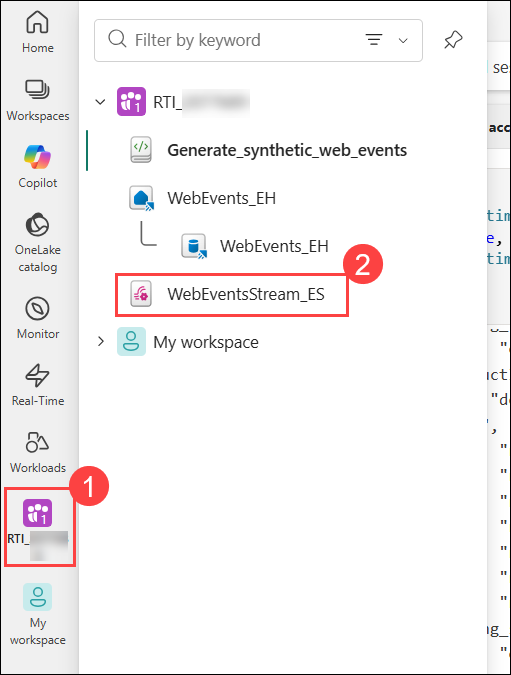
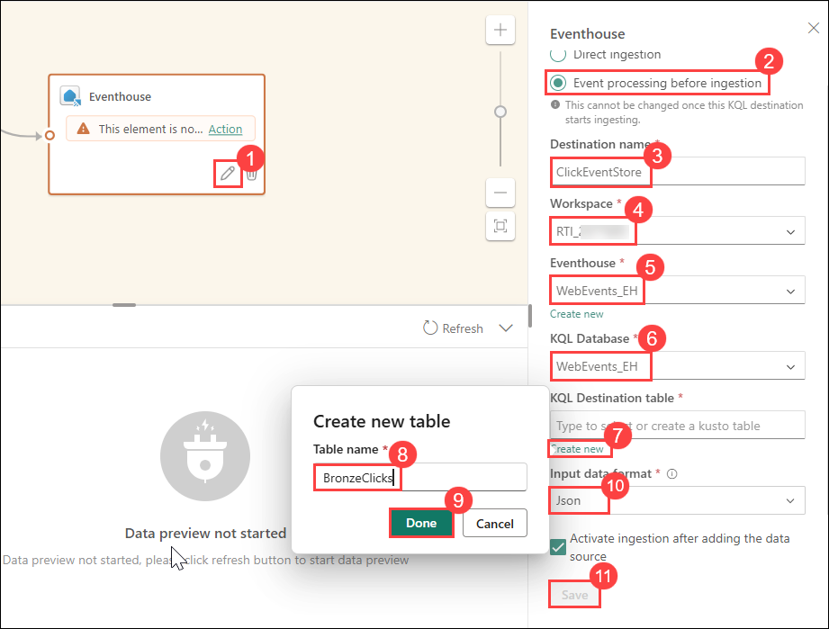

# Exercise 02: Real-Time Data Processing with Eventstream and Notebooks
### Estimated duration: 60 Minutes

## Overview

In this exercise, you will create an **Eventstream** while defining its topology for real-time data ingestion. Additionally, you will import and run a **Data Generator Notebook** to simulate streaming events.

## Objectives: 

In this exercise, you will be able to complete the following tasks:

- Task 1: Create a new Eventstream.
- Task 2: Import Data Generator Notebook.
- Task 3: Run the notebook.
- Task 4: Define Eventstream topology.

## Task 1: Create a new Eventstream

In this task, you will be streaming events (impressions and clicks events) generated by a notebook. The events will be streamed into an eventstream and consumed by our Eventhouse KQL Database.

1. From the left navigation pane, select your workspace **RTI_<inject key="DeploymentID" enableCopy="false"></inject> (1)** and select **RTI_<inject key="DeploymentID" enableCopy="false"></inject> (2)**.

    

1. Click on **+ New Item (1)**. In the popout window search for **Eventstream (2)** and select **Eventstream (3)** from the **Get data** section.

    

1. Give the Eventstream the name **WebEventsStream_ES (1)**. Click on **Create (2)**.

    

1. On the screen **Design a flow to ingest, transform, and route streaming events** click on **Use custom endpoint**. This will create an event hub connected to the Eventstream.

    

1. Insert `WebEventsCustomSource` **(1)** as the Source name and then click on **Add (2)**. 

    >**Note**: Leave the Schema association (preview) option disabled. Do not select the Activate checkbox. 

    

1. Click on **Publish** and now the Eventstream will be published and the Event Hub will be created.

    

1. Now, we need to collect the required information for the Notebook to use later: the event hub name and a connection string. Click on the Eventstream source named **WebEventsCustomSource** **(1)**. In the area below the diagram, click on **SAS Key Authentication (2)**. Then click on the **copy** icon beside the **Event hub name (3)** and **paste** it into a **notepad** to use it in the later steps. 

    

1. To copy the **Connection string-primary key** you first have to click on the view icon **(1)**. After the connection string is revealed. Click on the copy icon **(2)** and copy the connection string to Notepad as well.

    

    >**Note:** To copy the connection string it must be visible.

> **Congratulations** on completing the task! Now, it's time to validate it. Here are the steps:
> - Hit the Validate button for the corresponding task. If you receive a success message, you can proceed to the next task. 
> - If not, carefully read the error message and retry the step, following the instructions in the lab guide.
> - If you need any assistance, please contact us at cloudlabs-support@spektrasystems.com. We are available 24/7 to help you out.
<validation step="a91da02e-d4db-41ec-815d-2d9466790f8b" />

## Task 2: Import Data Generator Notebook
We use a python notebook to generate a stream of artificial click events. The notebook can be found in **C:\LabFiles** directory.

1. Navigate back to your workspace by clicking on **RTI_<inject key="DeploymentID" enableCopy="false"></inject> (1)** from the left navigation pane and then select it **(2)**.

    

1. Click on **Import (1)** option at the top center and select **Notebook (2)** and click on **From this computer (3)** option to import notebook file from your local drive.

    

1. In the right side pane **Import status**. Select **Upload**.

    

1. Browse to the **C:\LabFiles** folder and select the **Generate_synthetic_web_events(1)** notebook and click on the button **Open (2)**.

    

1. After the notebook has been uploaded Fabric will display a message that the notebook has been imported successfully.

## Task 3: Run the notebook
Now we have to run the notebook to create the stream of artificial click events for our lab. In order for the Notebook to send the events to the correct Event Hub we have to insert the information we have saved in Task Create Event Stream.To run the notebook and create our datastream please proceed with the following steps.

1. Click on the Notebook **Generate_synthetic_web_events** in your Fabric Workspace to open it.

    

    >**Note:** If prompted with **Enhance your notebook experience with AI tools** pop-up, click on **Skip tour**.

2. In the **Environment (1)** settings, click on the dropdown menu **(2)** and select **Change to workspace default(3)**.

         

3. IN the second cell, paste in the values your copied in **Task 1 - Create Event Stream** as values for `eventHubNameevents` and `eventHubConnString` into the `notebook`.

    

4. Click **Run all** at the top left to start generating streaming events.

    

    >**Note:** Errors in Cell 1 may occur due to pre-installed libraries in the environment. These can be safely ignored, as they will not impact the successful execution of the notebook.

    
    >**Note:** Wait a few minutes for the first code cell to finish and it will proceed to next code cells automatically. Please note that some cells may take 5 minutes or longer to execute.

5. Scroll to the last code cell, where the generated synthetic events should begin printing in JSON format. If the output matches the provided screenshot, the notebook is successfully streaming artificial click data to the Event Hub. **Let the last query run in the background, and proceed to the next task.**
   
    
   
    >**Note:** You may see a notebook execution or notebook save failure due to size limitations. This can be safely ignored as the data will continue to generate in the background and may exceed the allowed size.

## Task 4: Define Eventstream topology
In this task, you will create the Eventstream topology that will insert the streamed data into your KQL database.

1. Open your Eventstream in your Fabric Workspace by clicking on your **RTI_<inject key="DeploymentID" enableCopy="false"></inject> (1)** icon in the left pane, and then navigating to **WebEventStream_ES (2)**.

    

2. Click on **Edit** button located at the top-center.

    

3. Click on the node **Transform events or add destination (1)** and select **Filter (2)** from the menu.

    

4. Click on the pencil icon in the node **Filter** to enter edit mode.

    

5. Provide the following values in the pane Filter on the left side. Then click on **Save (5)**.

    | Field                  | Value          |
    |------------------------|----------------|
    | Operation name         | **ClickEventsFilter** **(1)** |
    | Select a field to filter on | **eventType** **(2)**   |
    | Keep events when the value | **equals** **(3)**     |
    | value                  | **CLICK** **(4)**        |

    

    >**Note:** Please write the **value** exactly as given in the lab guide; it must be in capital letters.

6. The **ClickEventsFilter** node showing an **error** is expected. This indicates that there is no target for the outgoing data stream, which will be resolved in the next step.

    >**Note**: Check the table at the bottom of the screen to view events streamed by the notebook to the Eventstream. If no data is visible, please refresh the Test Results section, you should then be able to see the data.

    
  
7. Click on **+** icon next to the **ClickEventsFilter** node.

    

8. Choose **Stream** from the context menu.

    

9. Click on the **Pencil (1)** in node **DerivedStream** to go to edit mode. In the right pane, Enter `ClickEventsStream` **(2)** as name of the Eventstream in the field **Stream name**. Ensure that the **Input data format** is **Json (3)**. Click on the button **Save (4)**.

    

10. Click on **+** icon next to the node **ClickEventsStream** and select the option **Eventhouse** in the context menu.

    

    

11. Click the pencil in node **Eventhouse (1)** to enter edit mode. Provide the following values in the pane Eventhouse and click the button **Save (11)** after you entered all the values.

    | Field                           | Value                                                                                                 |
    |----------------------------------|-------------------------------------------------------------------------------------------------------|
    | Event processing before ingestion| Ensure that this option is selected. **(2)**                                                                  |
    | Destination name                | **ClickEventStore (3)**                                                                                       |
    | Workspace                       | Select **RTI_<inject key="DeploymentID" enableCopy="false"></inject> (4)**                                  |
    | Eventhouse                       | Select the Eventhouse **WebEvents_EH (5)**                                                                     |
    | KQL Database                    | Select the KQL Database **WebEvents_EH (6)**                                                                   |
    | KQL Destination table               | Click on **Create new (7)** and enter **BronzeClicks (8)** as name for the new table and click on **Done (9)**.               |
    | Input data format               | Ensure that the option **Json (10)** is selected.                                                              |

    

12. Hover the mouse over the connection arrow between WebEventsStream_ES and ClickEventsFilter and click on the highlighted sign above the arrow.

    

13. Choose the option **Filter** from the context menu.

    

14. Delete the connection between the new filter node **Filter** and the node **ClickEventsFilter** by clicking on the trashcan icon.

    

15. Connect the output of the node **WebEventsStream_ES** to the input of the node **ClickEventsFilter**.

    

16. Click on the **pencil** icon of the new node **Filter (1)** to enter edit mode. Provide the following values in the pane **Filter (2)** on the right  side. Then click on **Save (3)**.

    | Field                  | Value            |
    |------------------------|------------------|
    | Operation name         | **ImpressionEventsFilter** |
    | Select a field to filter on | **eventType**      |
    | Keep events when the value | **equals**        |
    | value                  | **IMPRESSION**       |

    

    > **Note:** Please write the value exactly as given in the lab guide; it must be in capital letters.

17. The **ImpressionEventsFilter** node showing an **error** is expected. This indicates that there is no target for the outgoing data stream, which will be resolved in the next step.

18. Click on **+** sign next to the **ImpressionEventsFilter** node and choose **Stream** from the context menu.

    

    

19. Click on the **pencil (1)** icon in the node **DerivedStream** to enter edit mode. Enter `ImpressionsEventsStream` **(2)** as name of the Eventstream in the field **Stream name**. Ensure that the **Input data format** is **Json**. Click on the button **Save (3)**.

    

20. Click on **+** icon next to the node **ImpressionEventsStream** and select **Eventhouse** from the context menu.

    

    

21. Click the **pencil (1)** in node **Eventhouse** to enter edit mode. Provide the following values in the **pane (2)**, after providing these values click on the button **Save (3)**.

    | Field                           | Value                                                                                                 |
    |----------------------------------|-------------------------------------------------------------------------------------------------------|
    | Event processing before ingestion| Ensure that this option is selected.                                                               |
    | Destination name                | **ImpressionEventStore**                                                                                  |
    | Workspace                       | Select **RTI_<inject key="DeploymentID" enableCopy="false"></inject>**      |
    | Eventhouse                       | Select the Eventhouse **WebEvents_EH**                                                                     |
    | KQL Database                    | Select the KQL Database **WebEvents_EH**                                                                   |
    | KQL Destination table               | Click on **Create new** and enter **BronzeImpressions** as name for the new table and click on **Done**.           |
    | Input data format               | Ensure that the option **Json** is selected.                                                              |

    
22. Click on the button **Publish** that is located in the toolbar at the top of the screen.

    >**Note**: If you see any errors, please resolve them before publishing. Click on the pencil (edit) on the nodes where the error appears, reselect the missing fields, and save. You should then be able to publish successfully.

    

24. After a few minutes, you should see the nodes **ClickEventStore** and **ImpressionEventStore** change to mode **Active**.

    

25. At the end your Eventstream toplogy should look like the image below.

    

## Summary

In this exercise, you have created an Eventstream topology that filters click and impression events from the incoming stream of events and inserts them into separate tables in your KQL database in your Eventhouse. You have also run a notebook that generates synthetic click and impression events and sends them to the Eventstream.

### You have successfully completed the exercise. Now, click on **Next >>** from the lower right corner to proceed on to the next exercise.

