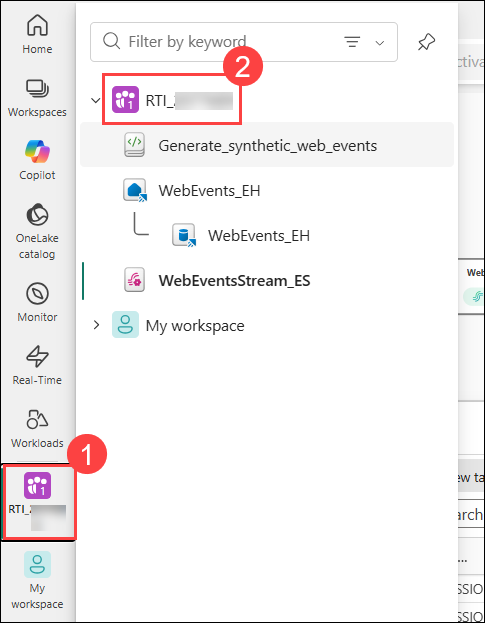
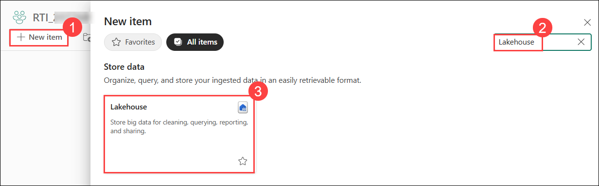
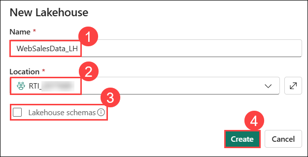
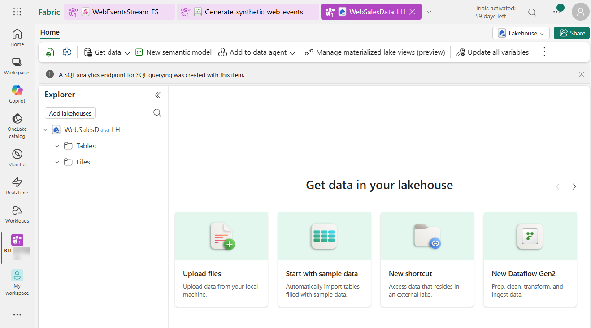
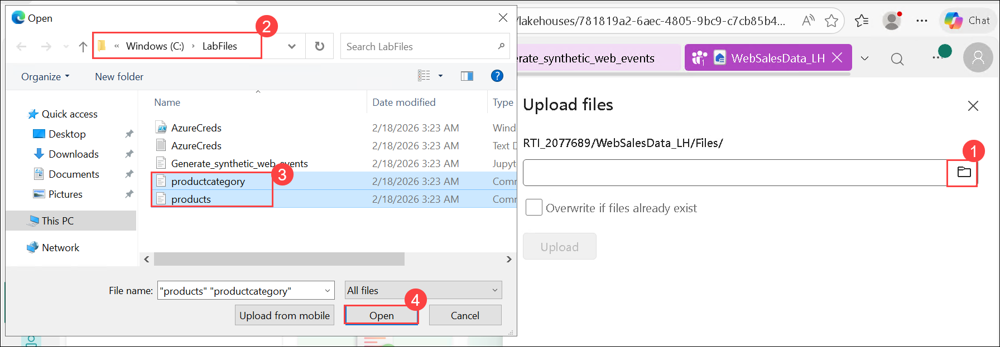
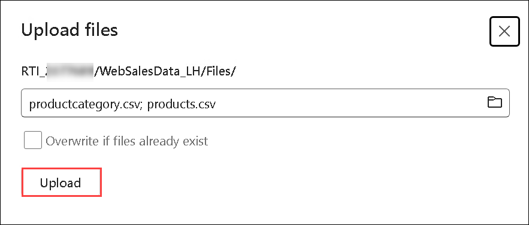
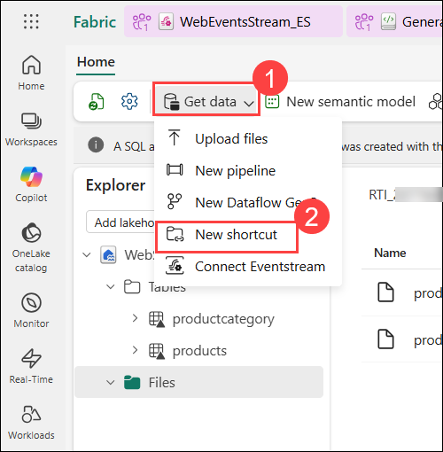
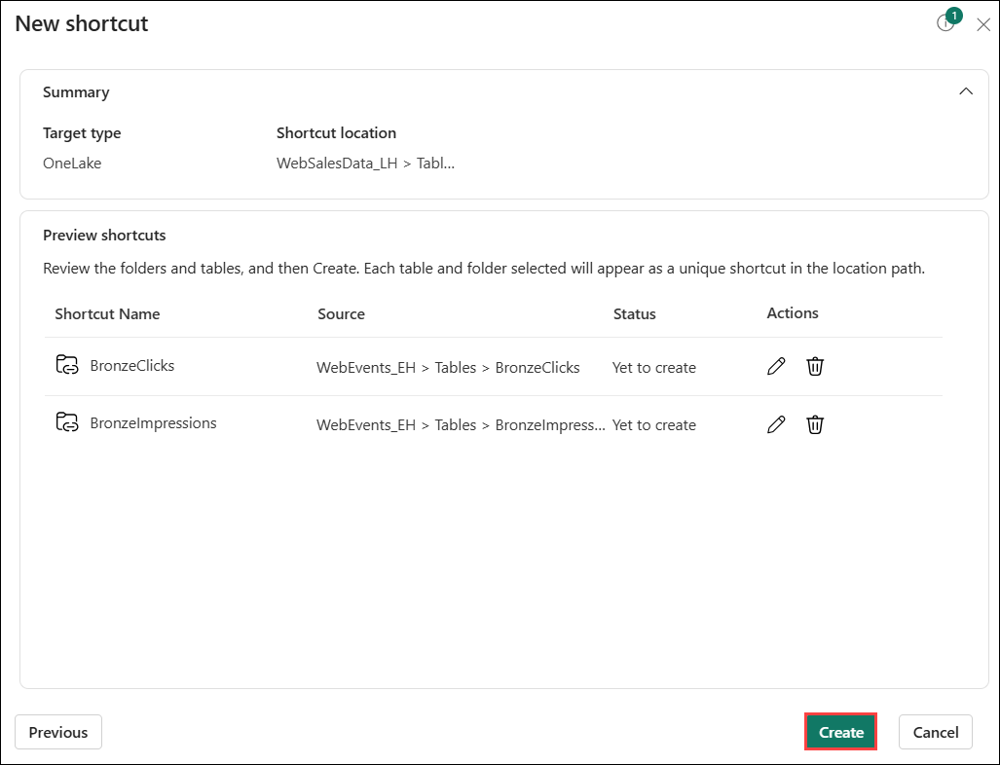

# Exercise 03: Integrating Eventhouse with Lakehouse

### Estimated duration: 60 Minutes

## Overview

In this exercise, you will set up a **Lakehouse**, and upload reference data to create delta tables. You will access **Eventhouse data from the Lakehouse**, build a **KQL Database schema**.

## Objectives: 

In this exercise, you will be able to complete the following tasks:

- Task 1: Setting up the Lakehouse.
- Task 2: Create delta tables in the lakehouse.
- Task 3: Accessing Eventhouse data from the lakehouse. 
- Task 4: Build the KQL DB schema.

## Task 1: Setting up the Lakehouse

In this task, you will set up the Lakehouse that will contain additional information for our use case and in which you will also make the data from the KQL Database accessible through the lakehouse.

1. To create a **Lakehouse**, first return to your assigned workspace **RTI_<inject key="DeploymentID" enableCopy="false"></inject> (1)** by clicking on it from the left navigation pane and select it **(2)**. 

    

1. Click on the button **+ New Item (1)** in the toolbar and in the pop-in window, search for **Lakehouse (2)** and click on the tile **Lakehouse (3)**.

    

1. In the dialog **New lakehouse**, enter `WebSalesData_LH` **(1)** as name for the new lakehouse. Select **RTI_<inject key="DeploymentID" enableCopy="false"></inject>** **(2)** as Location. Ensure that the checkbox **Lakehouse schemas (Public Preview)** is **not checked (3)**. Then click on the button **Create (4)**

    

1. You will be navigated to the overview page of the new lakehouse.

    

> **Congratulations** on completing the task! Now, it's time to validate it. Here are the steps:
> - Hit the Validate button for the corresponding task. If you receive a success message, you can proceed to the next task. 
> - If not, carefully read the error message and retry the step, following the instructions in the lab guide.
> - If you need any assistance, please contact us at cloudlabs-support@spektrasystems.com. We are available 24/7 to help you out.

<validation step="36131701-01b8-4da8-bb9d-b1a686ec3df5" />

## Task 2: Create delta tables in the lakehouse

After our lakehouse has been created the overview page of the lakehouse will be displayed. In this task we will load static data into our new lakehouse. To do so please execute the following steps.

1. Click on the button **Get data (1)** in the toolbar and select **Upload files (2)** from the dropdown menu.

    

1. In the **Upload** window that opens in the right side, click on the **Browse option (1)**. Navigate to `C:\LabFiles` **(2)** and select the two files **products.csv** and **productcategory.csv** **(3)**. Then click on the button **Open (4)**.

    

    >**Note:** To select the two files at once you can just hold the key CTRL key while you click the two files.

1. Click on the **Upload** button. Now the files will be uploaded.

    

1. To verify that the files have been uploaded successfully, Click on the folder **Files** in the **Explorer** pane. You should see the files in the list **Files** in the right part of the window.

    

1. Next, We have to create delta tables in our Lakehouse from the files we uploaded. 

1. Hover the mouse over the **productscategory.csv** file, click on the three does and select **Load to Tables (1)** from the context menu and in the submenu click on **New table (2)**

    

1. Retain all default values and click on the button **Load**.

    

1. Now repeat the same steps for the file **products.csv** to create a delta table for this file as well. At the end of this step, you should have 2 delta tables in your lakehouse created from the 2 csv files you uploaded.

1. Your lakehouse should look like this:

    

## Task 3: Accessing Eventhouse data from the lakehouse

In this task, you will make the Eventhouse tables from the KQL Database available in our Lakehouse. This will be accomplished by creating shortcuts.

1. Click on the button **Get data (1)** in the menu bar at the top. Choose **New shortcut (2)** from the dropdown menu.

    

    >**Note:** If your Lakehouse is using Schemas you will see the schema db under the folder Tables. right-click the schema dbo and select the option New table shortcut from the context menu.

1. Select **Microsoft OneLake**.

    

1. Select the KQL Database **WebEvents_EH (1)** in the window **Select a data source type** and click on the button **Next (2)**.

    

1. In the New shortcut window, expand the folder **Tables** under **WebEvents_EH** and check both tables **BronzeClicks** and **BronzeImpressions (1)**. Click on **Next (2)**.

    

1. You may return to this step to create additional shortcuts, after running the **createAll.kql** database script which will create additional tables. For now, you may proceed by selecting just the **BronzeClicks** and **BronzeImpressions** tables.

1. Click on the **Create** button.

    

1. Now you can see the shortcuts to the tables **BronzeClicks** and **BronzeImpressions** under the folder **Tables** in the lakehouse **WebSalesData_LH**.

    

## Task 4: Build the KQL DB schema

In this task, you will create all the silver tables, functions and enable update policies and in our Eventhouse KQL Database. Two of the tables (`product` and `productCategory)` are shortcuts to the lakehouse and the data is not being copied into our KQL Database.

1. From the left navigation pane, select your workspace **RTI_<inject key="DeploymentID" enableCopy="false"></inject>** **(2)**,  then select the KQL Database **WebEvents_EH**.

    

1. By now data has already streamed into you KQL-Database. You can see this by looking at the dashboard that is provided on the overview page of the KQL-Database    

    

1. Select the **WebEvents_EH (1)** database. Click on the button **+ New (2)** in the top toolbar and choose **OneLake shortcut (3)** from the drop down menu.

    

1. Select **Microsoft OneLake**.

    

1. Select the lakehouse **WebSalesData_LH (1)** and click on the button **Next (2)**.

    

1. Expand the Tables folder, and select the **products** and **productcategory** **(1)** tables. Click the **Next** **(2)** button, then click **Create (3)** on the next page. This will create shortcuts to the **products** and **productcategory** tables in your Lakehouse without copying the data from the Lakehouse to the Eventhouse.

    

    

1. On the **Shortcut creation completed** pop up, click **Close**.

    

1. Expand the **Shortcuts** folder in the tree of your KQL database **WebEvents_EH** to verify if the 2 shortcuts have been created correctly.

    

1. Click on the button **Query with code** at the top of the screen.

    

1. The popin window **Query with code** will be shown.

    

1. Copy the below code, and paste it into the the Queryset and **Run** it.

    ```kusto
    .execute database script <|
    //SILVER LAYER
    .create table SilverClicks (
        eventType:string, 
        eventID:string, 
        eventDate:datetime, 
        productId:long, 
        userAgent:dynamic, 
        device:string, 
        ip_address:string, 
        referer:dynamic, 
        page_loading_seconds:real, 
        clickType:string, 
        clickPathTitle:string, 
        clickPathUrl:string
    )
    //
    .create table SilverImpressions (
        eventType:string, 
        eventID:string, 
        eventDate:datetime, 
        productId:long, 
        userAgent:dynamic, 
        device:string, 
        ip_address:string, 
        page_loading_seconds:real, 
        relatedProductCategory:string, 
        relatedProductId:string, 
        relatedProductName:string
    )
    // use update policies to transform data during Ingestion
    .create-or-alter function with (folder="Bronze to Silver Transformations") expandClickpath()
    {
    BronzeClicks
    | mv-expand extraPayload
    | evaluate bag_unpack(extraPayload)
    | project 
        eventType, 
        eventID, 
        todatetime(eventDate), 
        productId, 
        userAgent, 
        device, 
        ip_address, 
        referer, 
        toreal(page_loading_seconds), 
        clickType = clickType, 
        clickPathTitle = ['title'], 
        clickPathUrl = url
    }
    //
    .alter table SilverClicks policy update @'[{"Source": "BronzeClicks", "Query": "expandClickpath", "IsEnabled" : true, "IsTransactional": false }]'
    //
    .create-or-alter function with (folder="Bronze to Silver Transformations") expandRelatedProducts()
    {
    BronzeImpressions
    | mv-expand extraPayload
    | evaluate bag_unpack(extraPayload)
    | project 
        eventType, 
        eventID, 
        todatetime(eventDate), 
        productId, 
        userAgent, 
        device, 
        ip_address, 
        toreal(page_loading_seconds), 
        relatedProductCategory, 
        relatedProductId, 
        relatedProductName
    }
    //
    .alter table SilverImpressions policy update @'[{"Source": "BronzeImpressions", "Query": "expandRelatedProducts", "IsEnabled" : true, "IsTransactional": false }]'
    //
    .create-or-alter function with (docstring = "Social Media Campaign Clickstream", folder = "Gold Views") SocialMediaCampaignClickstream()
    {
    SilverClicks
    | extend CampaignType = tostring(referer.campaignType)
    | extend Platform = tostring(userAgent.platform)
    | extend Browser = tostring(userAgent.browser)
    | extend RefererUrl = tostring(referer.url)
    | extend AdTitle = tostring(referer.adTitle)
    | where CampaignType in ("facebook", "twitter", "instagram", "pinterest")
    | project-away userAgent, referer
    | project-reorder CampaignType
    }
    //
    .create-or-alter function with (docstring = "Search Media Campaign Clickstream", folder = "Gold Views") SearchMediaCampaignClickstream()
    {
    SilverClicks
    | extend CampaignType = tostring(referer.campaignType)
    | extend Platform = tostring(userAgent.platform)
    | extend Browser = tostring(userAgent.browser)
    | extend RefererUrl = tostring(referer.url)
    | extend AdTitle = tostring(referer.adTitle)
    | where CampaignType in ("google", "bing")
    | project-away userAgent, referer
    | project-reorder CampaignType
    }
    //
    .create-or-alter function with (docstring = "Email Campaign Clickstream", folder = "Gold Views") EmailCampaignClickstream()
    {
    SilverClicks
    | extend CampaignType = tostring(referer.campaignType)
    | extend Platform = tostring(userAgent.platform)
    | extend Browser = tostring(userAgent.browser)
    | extend RefererUrl = tostring(referer.url)
    | extend EmailId = tostring(referer.emailId)
    | where CampaignType in ("email")
    | project-away userAgent, referer
    | project-reorder CampaignType
    }
    ```

    

1. The status of the execution of the commands from the file **createAll.kql** can be seen at the bottom of the pane. The result of each Command should be **Completed**.

    

1. Click on the pencil icon beside **Tab**  and rename the tab to **createAll**.

    

1. Expand all folders in the database pane on the left. All tables and functions that have been created by the script can be found here.

    

## Summary

In this exercise, you have set up a Lakehouse, uploaded reference data to create delta tables, accessed Eventhouse data from the Lakehouse by creating shortcuts, and built a KQL Database schema by creating tables. 

### You have successfully completed the exercise. Now, click on **Next >>** from the lower right corner to proceed on to the next exercise.


