# Exercise 04: Building an Interactive Real-Time Dashboard with Live Data
### Estimated duration: 90 Minutes

## Overview

In this exercise, you will develop a **Real-Time Dashboard** with auto-refresh for live insights. Finally, you will use **Data Activator** to automate actions based on real-time data.

## Objectives:

In this exercise, you will be able to complete the following tasks:

- Task 1: Real-Time Dashboard. 
- Task 2: Enable Auto-refresh to your dashboard.  
- Task 3: Enable Data Activators.

## Task 1:  Real-Time Dashboard 

In this task, you will build a real-time dashboard to visualize the streaming data and set it to refresh every 30 seconds. (Optionally) A pre-built version of the dashboard is available to download here, which can be imported and configured to your KQL Database data source.


1. From the left navigation pane, select your workspace **RTI_<inject key="DeploymentID" enableCopy="false"></inject> (1)** and select **RTI_<inject key="DeploymentID" enableCopy="false"></inject> (2)**.

    

1. To create a new realtime dashboard click on the button **+ New Item  (1)**, search for **Real-Time Dashboard (2)** and select **Real-Time Dashboard  (3)**.

    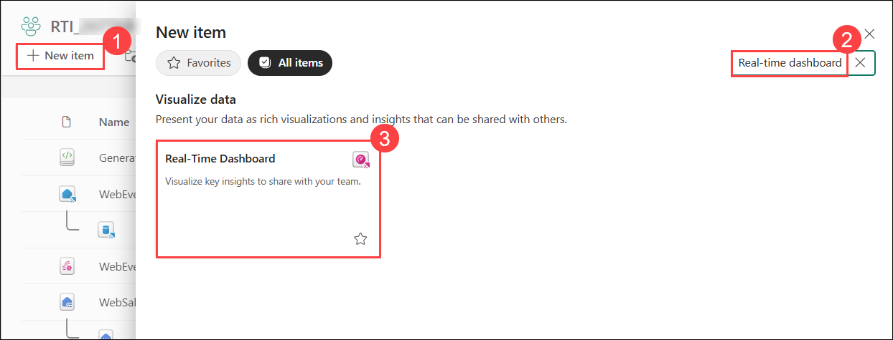

1. Enter the name as **Web Events Dashboard (1)**. Select location as **RTI_<inject key="DeploymentID" enableCopy="false"></inject> (2)**, then click on **Create (3)**.

    

1. Select **WebEvents_EH** *KQL Database* listed under Suggested from the workspace

    

    >**Note:** Close the Data sources window which opens on the right side of the browser after selecting the KQL database.

1. Proceed to paste each query below, add a visual, and apply changes.

1. From the Home tab **(1)**, click on the button **New tile (2)** to create a new tile for the dashboard.

    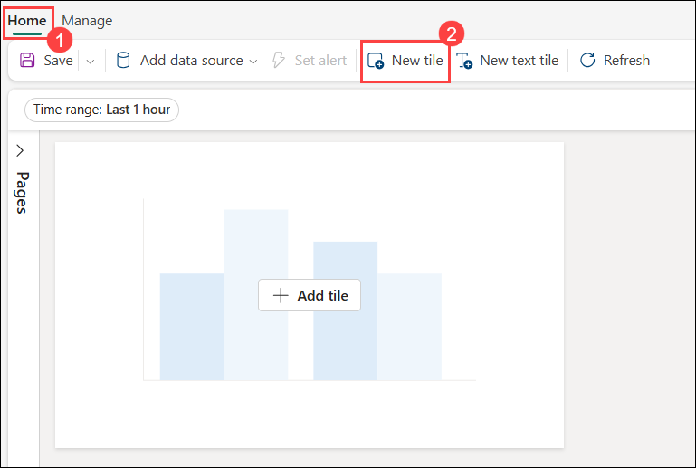

1. This visual will show the **Clicks by hour**. It will use the following query.

    ```kusto
    SilverClicks
    | where eventDate between (_startTime.._endTime)
    | summarize date_count = count() by bin(eventDate, 1h)
    | render timechart
    | top 30 by date_count
    ```

1. Replace the content of the textbox by the code above. Click on the time range parameter at the top of the screen and set it to **Last 7 days  (1)**. This parameter is referenced by the query in the `where` clause by using fields `_startTime` and `_endTime`. Click on the button **Run  (2)**. The query will be executed and the results will be shown in the table at the bottom. To create a visualisation click on the button **+ Add Visual  (3)**. This will open a pane at the right side of the browser.

    

1. Format the visual by entering`Click by hour` **(1)** in the field **Tile name**. Select **Area chart  (2)** under **Visual type.** Then click on the button **Apply changes  (3)**.

    

1. Click on the tab **Manage  (1)** on the top left then click on the button **Parameters  (2)**.

    

1. On the Parameters window which opens on the right side, click on the **pencil** icon under **Time range**. This will enter the edit mode for this parameter.

    

1. Select **Last 7 Days  (1)** in the combo box **Default value**. Then click on **Done (2)**.

    

1. In the Parameters pane click on the button **Close**.

    

1. Click on the **Home (1)** tab and then click on the button **New tile (2)** to proceed with the next visuals.

    

1. Enter the following query, then click on the **Run (1)** button. To create a visualisation click on the button **+ Add Visual (2)**.

    ```kusto
    //Impressions by hour
    SilverImpressions
    | where eventDate between (_startTime.._endTime)
    | summarize date_count = count() by bin(eventDate, 1h)
    | render timechart
    | top 30 by date_count
    ```

    
    
1. Format the visual by entering `Impressions by hour` **(1)** in the field **Tile name**. Select **Area chart  (2)** under **Visual type.** Then click on the button **Apply changes  (3)**.

    

1. From the **Home** tab, click on the **New tile** button again to proceed with the next visuals.

    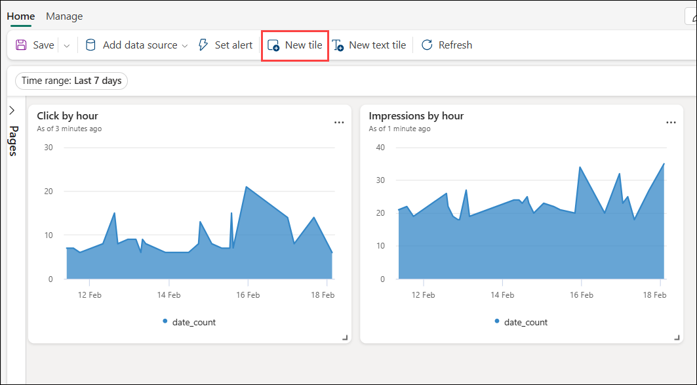

1. Enter the following query, then click on the **Run (1)** button. To create a visualisation click on the button **+ Add Visual (2)**.

    ```kusto
    //Impressions by location
    SilverImpressions
    | where eventDate  between (_startTime.._endTime)
    | join external_table('products') on $left.productId == $right.ProductID
    | project lon = toreal(geo_info_from_ip_address(ip_address).longitude), lat = toreal(geo_info_from_ip_address(ip_address).latitude), Name
    | render scatterchart with (kind = map) //, xcolumn=lon, ycolumns=lat)
    ```

   

1. Format the visual by entering `Impressions by location` **(1)** in the field **Tile name**. Select **Map  (2)** under **Visual type.** Then click on the button **Apply changes  (3)**.

    

1. From the **Home** tab, click on the **New tile (2)** button again to proceed with the next visuals.

    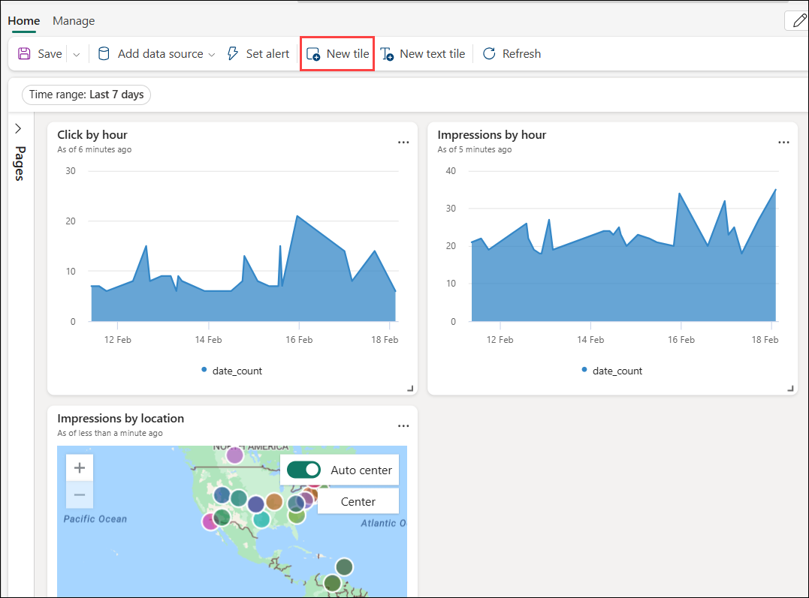

1. Enter the following query, then click on the **Run (1)** button. To create a visualisation click on the button **+ Add Visual (2)**.

    ```kusto
    //Average Page Load time
    SilverImpressions
    | where eventDate   between (_startTime.._endTime)
    //| summarize average_loadtime = avg(page_loading_seconds) by bin(eventDate, 1h)
    | make-series average_loadtime = avg(page_loading_seconds) on eventDate from _startTime to _endTime+4h step 1h
    | extend forecast = series_decompose_forecast(average_loadtime, 4)
    | render timechart
    ```

   

1. Format the visual by entering `Average Page Load Time` **(1)** in the field **Tile name**. Select **Time chart (2)** under **Visual type.** Then click on the button **Apply changes  (3)**.

    

1. From the **Home** tab, click on the **New tile (2)** button again to proceed with the next visuals.

    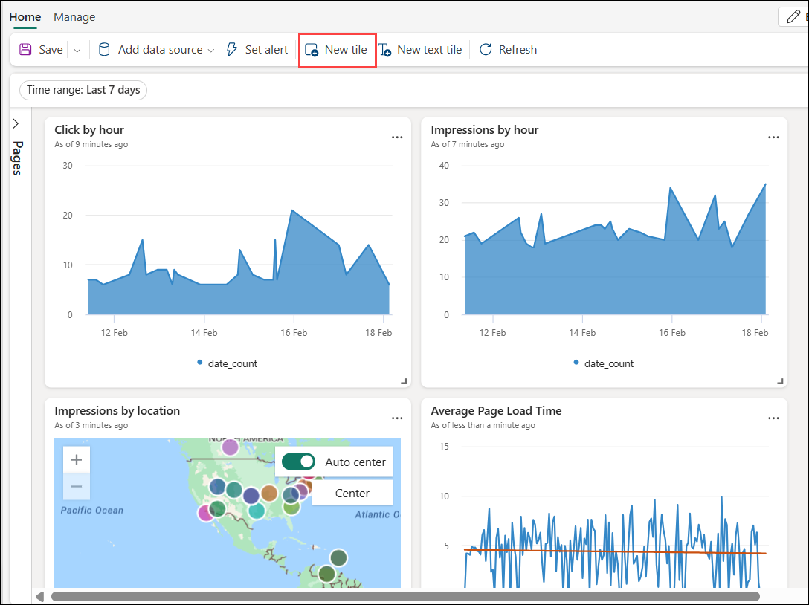

1. Enter the following query, then click on the **Run (1)** button. To create a visualisation click on the button **+ Add Visual (2)**.

    ```kusto
    //Clicks, Impressions, CTR
    let imp =  SilverImpressions
    | where eventDate  between (_startTime.._endTime)
    | extend dateOnly = substring(todatetime(eventDate).tostring(), 0, 10)
    | summarize imp_count = count() by dateOnly;
    let clck = SilverClicks
    | where eventDate  between (_startTime.._endTime)
    | extend dateOnly = substring(todatetime(eventDate).tostring(), 0, 10)
    | summarize clck_count = count() by dateOnly;
    imp
    | join clck on $left.dateOnly == $right.dateOnly
    | project selected_date = dateOnly , impressions = imp_count , clicks = clck_count, CTR = clck_count * 100 / imp_count
    ```

   

1. Enter **Impressions (1)** in the field **Tile name**. Select **Stat (2)** in the **Visual type**. In **Data** Value column select **impressions (long) (3)**. Then click on the button **Apply changes (4)**.

    

1. Click the 3-dots (...) **(1)** at the top right of the Impressions tile you just created and select **Duplicate  (2)** and duplicate it one more times.

    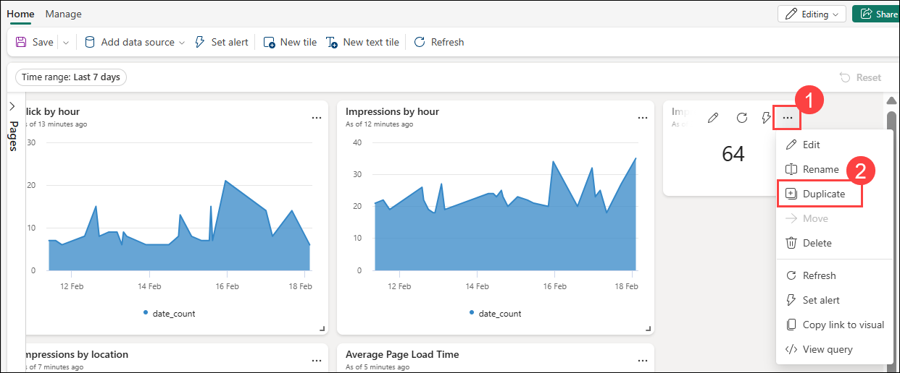

    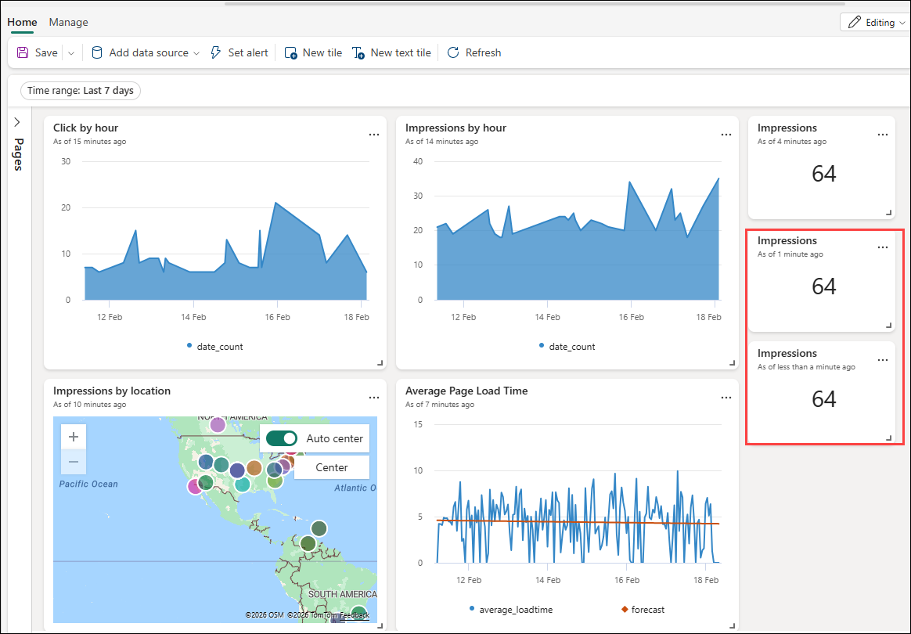

1. Click the 3-dots (...) **(1)** on 1st duplicate and select **Edit (2)** to edit the tile.

    

1. Enter the **Tile name** as **Clicks (1)**, set the Data value column to **clicks (long) (2)**, then click on the button **Apply changes (3)**.

    

1. Click the 3-dots (...) **(1)** on another duplicate and select **Edit (2)** to edit the tile.

    

1. Enter the **Tile name** as **Click Through Rate (1)**, set the Data value column to **CTR (long) (2)**, then click on the button **Apply changes (3)**.

    

1. From the **Home** tab, click on the **New tile (2)** button again to proceed with the next visuals.

    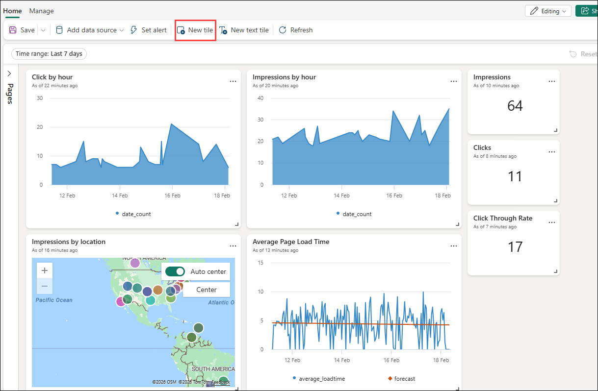

1. Enter the following query, then click on the **Run (1)** button. To create a visualisation click on the button **+ Add visual (2)**.

    ```kusto
    //Avg Page Load Time Anomalies
    SilverImpressions
    | where eventDate   between (_startTime.._endTime)
    | make-series average_loadtime = avg(page_loading_seconds) on eventDate from _startTime to _endTime+4h step 1h
    | extend anomalies = series_decompose_anomalies(average_loadtime)
    | render anomalychart
    ```

   

1. Format the visual by entering `Average Page Load Time Anomalies` **(1)** in the field **Tile name**. Select **Anomaly Chart (2)** under **Visual type.** Then click on the button **Apply changes  (3)**.

   

1. From the **Home** tab, click on the **New tile (2)** button again to proceed with the next visuals.

    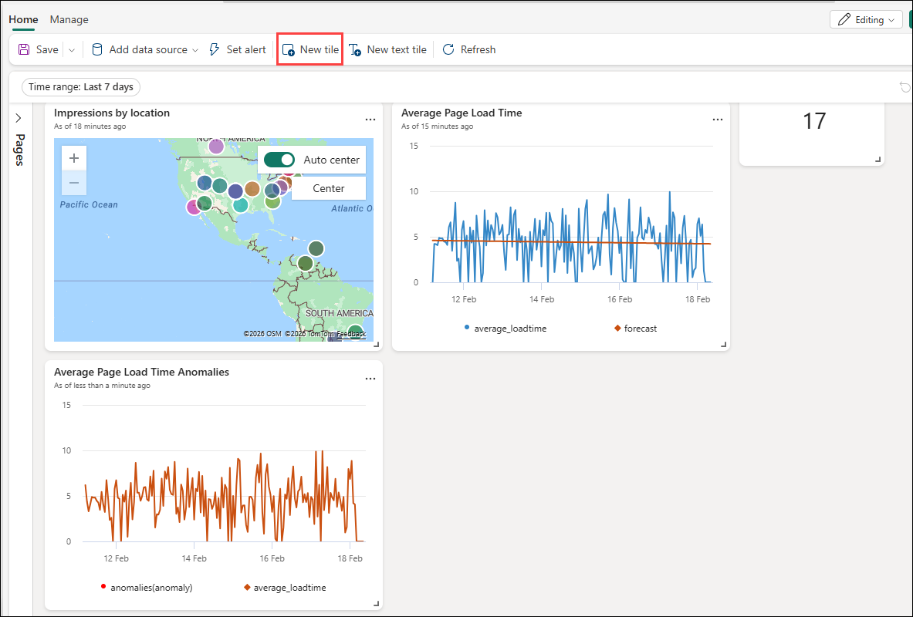

1. Enter the following query, then click on the **Run (1)** button. To create a visualisation click on the button **+ Add visual (2)**.
    
    ```kusto
    //Strong Anomalies
    SilverImpressions
    | where eventDate between (_startTime.._endTime)
    | make-series average_loadtime = avg(page_loading_seconds) on eventDate from _startTime to _endTime+4h step 1h
    | extend anomalies = series_decompose_anomalies(average_loadtime,2.5)
    | mv-expand eventDate, average_loadtime, anomalies
    | where anomalies <> 1
    | project-away anomalies
    ```

    

1. Format the visual by entering `Strong Anomalies` **(1)** in the field **Tile name**. Select **Table (2)** under **Visual type.** Then click on the button **Apply changes  (3)**.

    

1. To add a **Logo**, click on the **New text tile** button from the top menu bar.

    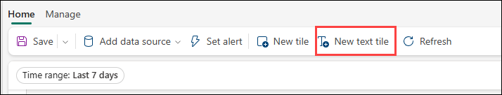

1. Paste the following code in the text area and click on the button **Apply changes**.

    ```kusto
    //Logo (Markdown Text Tile)
    
    ```
   

   >**Note:** The title can be resized on the dashboard canvas directly, rather than writing code.

1. After you added all the visuals and moved them to thier appropiate places your dashboard should look similar to the below image.

    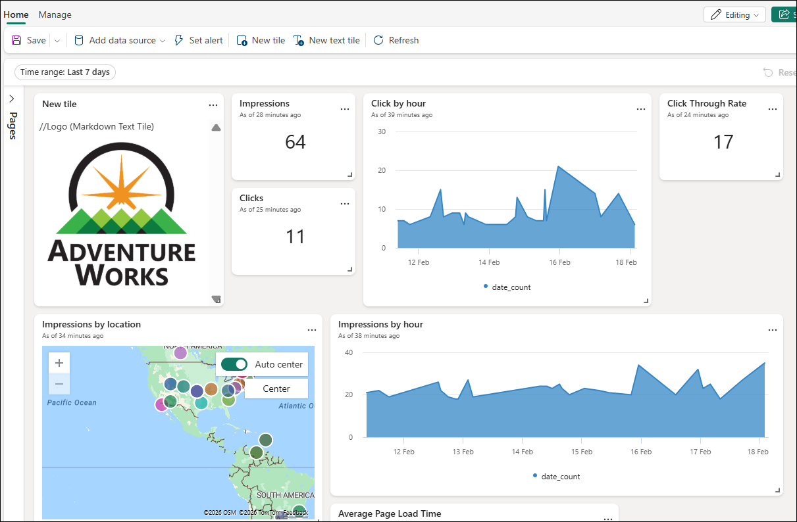

> **Congratulations** on completing the task! Now, it's time to validate it. Here are the steps:
> - Hit the Validate button for the corresponding task. If you receive a success message, you can proceed to the next task. 
> - If not, carefully read the error message and retry the step, following the instructions in the lab guide.
> - If you need any assistance, please contact us at cloudlabs-support@spektrasystems.com. We are available 24/7 to help you out.

<validation step="02a20e12-54b5-4b37-9c8f-d4198f9f4430" />

## Task 2: Enable Auto-refresh to your dashboard.

In this task, you will enable auto-refresh so the dashboard will be automatically updated while it is shown on screen.

1. Click on the tab **Manage  (1)** and then click on the button **Auto refresh (2)** This will open a pane on the right side of the browser.

    

1. In thr **Auto refresh** window which opens on the righ side, set it to **Enabled (1)** and set **Default refresh rate** to **Continous (2)**. Then click on the button **Apply (3)**.

    

1. Click on the **Home (1)** tab and then click on the **Save (2)** button.

    

## Task 3: Enable Data Activators

In this task, you will create a Reflex Alert that will send a Teams Message when a value meets a certain threshold.

1. While editing the dashboard, click on the three dots **(...) (1)** of the tile **Click by hour**. Select **Set alert (2)** from the context menu. This will open the pane **Set alert** at the right side in the browser.

    

1. Enter a rule name.

    

1. In the pane **Set alert** set the values as stated in the following table

    | Field                | Value                      |
    |----------------------|----------------------------|
    | Check                | **On each event grouped by** (1)  |
    | Grouping field       | **eventDate** (2)                |
    | When                 | **date_count** (3)                |
    | Condition            | **is greater than** (4)      |
    | Value                | **250** (5)                     |
    | Occurance            | **None** (6)           |

    

1. Under **Actions** select action as **Email**.

    

1. In the combo box Workspace select the workspace **RTI_<inject key="DeploymentID" enableCopy="false"></inject>**. Ensure that in the combo box Item the value **Create a new item (1)** is selected. Insert **My activator (2)** as value for the field New item name. Then click on the button **Create (3)**.

   > **Note:** You may choose your preferred option in your daily life, but for this lab, we will not be doing it as it is for demonstration purposes.
    
   

1. The Reflex item will appear in your workspace and you can edit the Reflex trigger action. The same Reflex item can also trigger multiple actions.

## Review

In this lab you have completed the following:
- Created a Real-Time Dashboard. 
- Enabled Auto-refresh to your dashboard.  
- Enabled Data Activators.

### You have successfully completed the labs.

By completing this lab **Build A Fabric Real-Time Intelligence Solution in a Day**, you establish an end-to-end real-time data analytics solution in Microsoft Fabric. Starting with creating a collaborative workspace and setting up an Eventhouse, you integrate data seamlessly using OneLake and Eventstream, simulate and process streaming data, and organize it efficiently in a Lakehouse with tables. Leveraging KQL for structured querying, you transform raw event data into actionable insights, culminating in the development of an interactive real-time dashboard and automated event driven actions through Data Activator, enabling timely and informed decision making.
